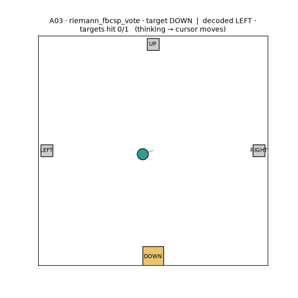
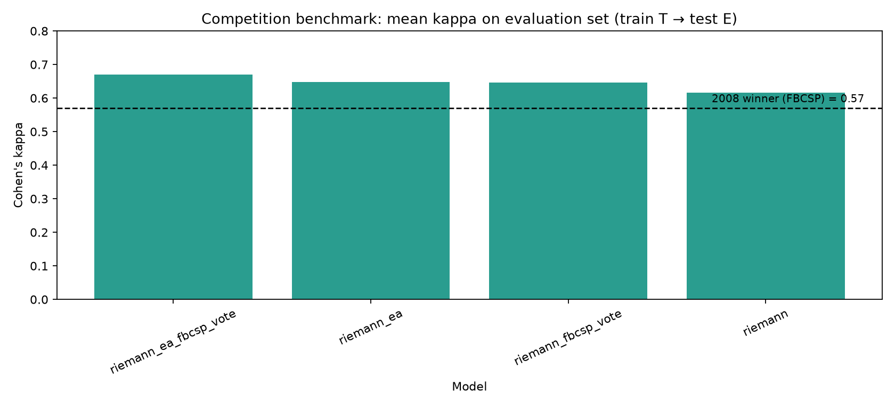

# 🧠 EEG Motor-Imagery Decoding

Decode **imagined movement** from scalp EEG — the non-invasive cousin of a Neuralink-style brain-computer interface. This project builds, benchmarks, and takes *live* a motor-imagery decoder on **BCI Competition IV Dataset 2a**.


<p align="center">
  
</p>

> Four classes — imagined **left hand · right hand · feet · tongue** — decoded from 22 EEG channels, then streamed to move a cursor.

---

## ⭐ Headline result

A **Riemannian-geometry** decoder with **session alignment**, ensembled with FBCSP, reaches **mean Cohen's kappa = 0.670** on the official train-on-`T` / test-on-`E` protocol — comfortably beating the **2008 competition winner (0.57)**, and beating modern deep learning on this dataset.

<p align="center">
  
</p>

| Model | Mean accuracy | **Mean kappa** |
|---|---|---|
| `riemann_ea_fbcsp_vote` — **best** (alignment + ensemble) | 0.753 | **0.670** |
| `riemann_fbcsp_vote` (ensemble) | 0.735 | 0.647 |
| `riemann_ea` (aligned, single model) | 0.735 | 0.647 |
| `riemann` (filter-bank tangent space) | 0.712 | 0.616 |
| `fgmdm` (filter-bank geodesic MDM) | 0.703 | 0.604 |
| `fbcsp` (reproduces the 2008 method) | 0.675 | 0.566 |
| `shallow_convnet` (best deep net) | 0.627 | 0.503 |
| `random_forest` (CSP + random forest) | 0.622 | 0.496 |
| `svm` (CSP + RBF SVM) | 0.620 | 0.493 |
| `logistic_regression` (CSP + logistic regression) | 0.616 | 0.488 |
| `mdm` (filter-bank MDM) | 0.595 | 0.460 |
| — *2008 winner (Ang et al., FBCSP)* | — | *0.57* |

---

## 🚀 Quick start

```powershell
python -m venv .venv
.\.venv\Scripts\Activate.ps1
python -m pip install -r requirements.txt
```

Place the raw `.gdf` files in `data/BCICIV_2a_gdf/` (they're gitignored — large dataset files). Then:

```powershell
# Extract labeled epochs
python pipeline.py prepare

# Run the competition benchmark (train T -> test E, kappa vs the 2008 winner)
python pipeline.py benchmark --models riemann riemann_ea_fbcsp_vote fbcsp
```

**Try the live pipeline with no hardware** — publish a synthetic EEG stream in one terminal, decode it in another:

```powershell
python pipeline.py mock-stream          # terminal 1: fake EEG over LSL
python pipeline.py live-demo --duration 30   # terminal 2: real-time decode loop
```

---

## 🔬 How it works

**Preprocessing** — MNE loads the GDF files, drops the 3 EOG channels, keeps 22 EEG channels, band-passes (4–40 Hz broadband for the benchmark; each decoder re-filters internally), resamples to 125 Hz, and epochs 0.5–4.0 s after each cue.

**Decoders** (`eeg_project/decoding/`):
- **Classical** — CSP+LDA, **FBCSP** (filter-bank CSP + mutual-information selection), and **Riemannian** filter-bank tangent-space decoders. Plus **session alignment** (`riemann_ea` / `riemann_ra`) and soft-vote **ensembles**.
- **Neural** — compact EEGNet-style CNN, ShallowConvNet, EEG-TCNet, a short ResNet (PyTorch).

**Protocol** — the official 2a evaluation: train on `A0XT.gdf`, test on the held-out `A0XE.gdf` using the labels in `data/true_labels/`, and average **Cohen's kappa** across all 9 subjects (kappa, not accuracy, because 4-class chance is already 25%).

---

## 💡 Key findings

**1. Classical geometry beats deep learning here — and the reason is data.**
Each subject has only ~72 trials per class. Riemannian methods encode the neuroscience directly (motor imagery = covariance change across channels), so they start where a CNN is only *trying* to get. **Inductive bias beats raw capacity when data is scarce** — a genuine, reproducible result, consistent with the literature.

**2. Session alignment is the single biggest algorithmic win.**
Train and test are separate recordings, so the signal *drifts*. **Euclidean Alignment** recenters each session's covariances to a common reference, cancelling that drift — lifting kappa from 0.647 → **0.670** and improving 7 of 9 subjects.

**3. Calibration must be per-person.**
One model pooled across all subjects scored **0.360**; per-subject it scored **0.647**. Brains differ — this is the core lesson for any real BCI.

**Honest negatives** (documented, not hidden): MDM was weaker than tangent-space Riemannian decoding, FgMDM was strong but not a new best, a stacking meta-learner was a wash, Riemannian vs Euclidean alignment tied exactly, and crop/window augmentation *hurt* (0.562) — because it helps neural nets but a covariance needs the whole trial.

---

## 🎛️ Toward a live BCI

The repo includes a full Lab Streaming Layer (LSL) path from a headset to a moving cursor:

```
EEG headset  ->  LSL stream  ->  live-demo (sliding-window decode + smoothing + online alignment)
```

- **`mock-stream`** — publishes synthetic EEG so you can exercise the entire live path (buffering, windowing, decoding, smoothing) **without hardware**.
- **`calibrate-gui` / `calibrate-train`** — record cued trials from *your* EEG and fit a personal decoder.
- **Online alignment** — `live-demo --align-windows` runs each decode over a rolling batch of recent windows, so aligned decoders track drift in real time without labels (the streaming-safe version of the offline EA).
- **`rest` class + smoothing + confidence threshold** — so noisy windows don't jitter the cursor.

When real hardware arrives you swap `mock-stream` for the headset's LSL bridge (OpenBCI GUI, muselsl, …) and nothing downstream changes.

---

## 📋 Command reference

| Command | What it does |
|---|---|
| `prepare` | Extract labeled motor-imagery epochs |
| `benchmark` | Competition protocol: train T → test E, report kappa |
| `pooled-benchmark` | Train one model on all subjects pooled (ablation) |
| `train` | Within-subject train/test-split evaluation |
| `demo` | Offline cursor-control demo → GIF |
| `replay-live` | Interactive cursor GUI replaying held-out 2a EEG (no hardware) |
| `mock-stream` | Publish synthetic EEG over LSL to test the live pipeline |
| `live-demo` | Real-time decode of a live LSL EEG stream |
| `calibrate-gui` / `calibrate-record` / `calibrate-train` | Personal-calibration workflow |
| `gui` | Launcher window for the demos above |
| `inspect` | Inspect a raw GDF file |

Run any command with `--help` for its options.

---

## 📁 Repository layout

```
pipeline.py                 # entry point -> eeg_project.cli
eeg_project/
  cli.py                    # command-line interface
  io/         config, data  # loading, filtering, epoching
  decoding/   decoders, cnn, models   # the decoders (classical + neural)
  eval/       benchmark, reporting    # protocol, metrics, plots
  demos/      cursor_demo, live_demo, replay_gui, launcher_gui,
              calibration, mock_lsl   # demos + live BCI
  results.py                # shared EvalResult record
data/         BCICIV_2a_gdf/ (gitignored), true_labels/
docs/         PROJECT_HISTORY.md, PRESENTATION.md
```


## 📚 Docs

- **[docs/FINAL_PROJECT_REPORT_HE.md](docs/FINAL_PROJECT_REPORT_HE.md)** — final Hebrew submission report: dataset, research questions, code summary, algorithms, results, challenges, and analysis.
- **[docs/PROJECT_HISTORY.md](docs/PROJECT_HISTORY.md)** — detailed project narrative (Hebrew): research questions, every experiment, results, and challenges.
- **[docs/PRESENTATION.md](docs/PRESENTATION.md)** — a timed 10-minute slide-by-slide talk script.
